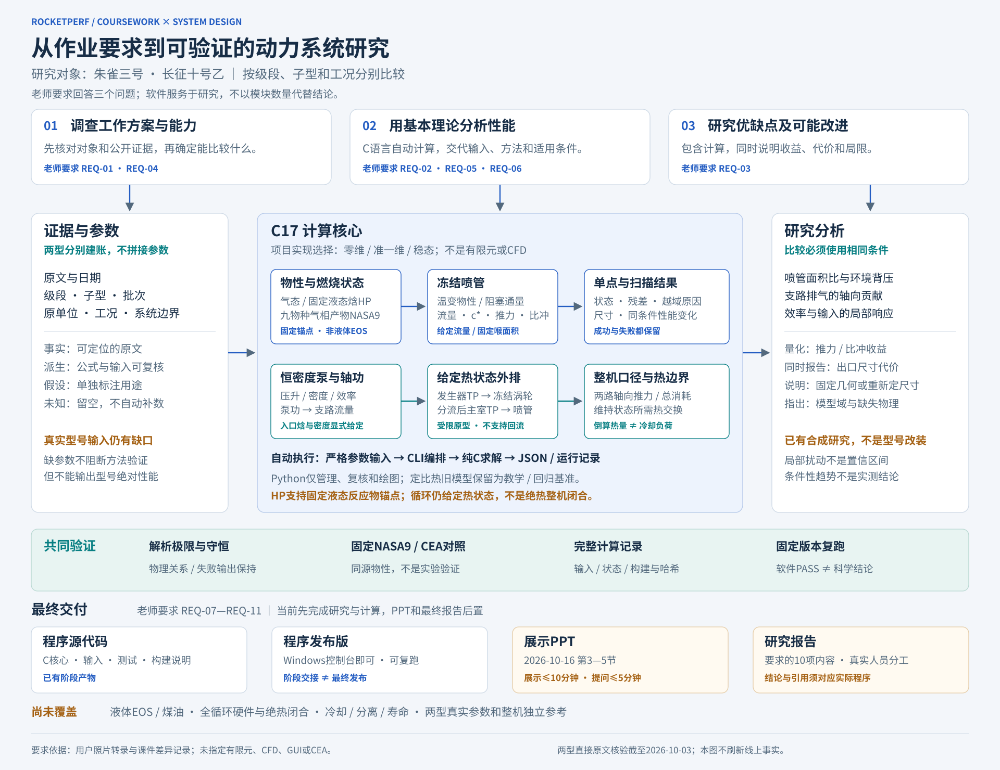

# 火箭发动机原理 · Rocketperf

研究朱雀三号与长征十号乙的动力系统，用C程序完成性能分析与改进研究。当前C核心包含定比热教学喷管、固定NASA9物性、九气相CH4/O2的TP/HP、固定液态锚点HP、连续单相液体密度/化学焓查表、冻结喷管和给定热状态外排循环边界。真实型号输入仍有缺口；方法基准和循环合成算例不能当作飞行发动机性能。

[打开作业对接与架构图](docs/architecture/index.html) · [当前工作](worknow.md) · [任务板](docs/tasks.md) · [治理规范](docs/governance.md)

接收与讲解先读[项目详细解读](docs/project-guide.md)。纯C源码和Windows运行包通过[私有GitHub阶段Releases](https://github.com/2725238326/rocketperf-course-research/releases)交付；包的范围、编译/运行和核验见[交付说明](docs/delivery.md)。源码包不含Python/Fortran程序，完整仓库保留开发工具与研究证据。

先看[两型四级段：证据与计算落点](docs/two-vehicle-study.md)：公开工作方案、已有C结果和不可计算项分别列出。其[数据映射](data/parameters/assignment_case_map.json)可检查角色、版本/级段和方法引用，不是型号求解输入，也不证明原文科学语义。

交给其他同学时先看[阶段交接与接收验收](docs/receiving.md)。干净提交和完整质量通过后，`python tools/handoff.py create --destination build/handoff-NEW-ID`生成本地运行包与离线源码bundle；不依赖远端已推送，不等同于最终课程发布。

技术路线已确定：[C17核心、零维/准一维/稳态模型、CLI与离线报告](docs/technology-stack.md)。该决定明确工具职责，不代表高级模型已实现。



## 开始工作

需要Python 3.10+和GCC；PowerShell是可选兼容入口。根目录执行：

```powershell
python tools/project.py doctor
python tools/quality.py
python tools/pipeline.py run --case cases/benchmarks/air_mach2_vacuum.ini
```

运行工具核对新鲜的构建/测试证据，保存输入、实际二进制、报告和哈希到 `results/local/<RunId>/`。失败也保留记录。同名RunId不能覆盖。

## 实际运行燃烧与喷管

完整质量检查后，在Windows本地运行气态方法基准：

```powershell
./build/release/rocketperf.exe combustion hp 10000000 3.4 298.15 298.15
./build/release/rocketperf.exe combustion frozen 10000000 3.4 298.15 298.15 40 0
python tools/combustion_reference.py
```

第一条算燃烧室温度和组分；第二条继续算冻结喷管；第三条从已测具体构建复跑四个固定工况、与CEA自动比对并保留记录。`build/release`中的exe是便捷别名，追溯以manifest指向的实际构建为准。条件与验证见[热化学与喷管](docs/thermo-nozzle-validation.md)。

新增[显式入口焓HP](docs/adiabatic-inlet-validation.md)：直接给出同NASA9形成焓基准的气态CH4/O2入口焓，求绝热气相温度并接固定面积喷管；不改变循环、不是液态模型。`python tools/adiabatic_inlet.py verify results/validation/adiabatic_inlet_v1`可离线复核15次保存运行、固定CEA对照及预期失败。

[连续单相液体查表](docs/liquid-feed-validation.md)可直接查询假设温压下的密度和化学焓，C运行无需CoolProp：

```powershell
./build/release/rocketperf.exe liquid-feed coolprop710-cea334-liquid-molar-v1 Methane liquid 120 10000000
./build/release/rocketperf.exe liquid-feed coolprop710-cea334-liquid-molar-v1 Oxygen liquid 100 10000000
```

两种质量约定和适用域在JSON中显式返回。连续表已经可作为假设液体入口接入九气相HP和固定面积冻结喷管；仍不包含泵升压、喷注、分流轴功或完整循环。气态、固定液态锚点与连续入口模型按各自ID和边界使用。

连续液体入口的运行与CEA显式焓对照见[液体入口HP核验](docs/liquid-combustion-validation.md)：

```powershell
./build/release/rocketperf.exe combustion hp-liquid-state coolprop710-cea334-liquid-molar-v1 heos710-cea334-ideal-zero-298.15-v1 liquid 120 10000000 100 10000000 10000000 3.4
./build/release/rocketperf.exe combustion frozen-liquid-state coolprop710-cea334-liquid-molar-v1 heos710-cea334-ideal-zero-298.15-v1 liquid 120 10000000 100 10000000 10000000 3.4 10 0 0.01
python tools/liquid_combustion.py verify results/validation/liquid_combustion_v1
```

循环合成算例可直接运行并归档：

```powershell
python tools/pipeline.py run --model prescribed-cycle --case cases/benchmarks/prescribed_cycle.ini
```

该命令输出并保存泵功、涡轮轴功、外排支路、两路推力及热交换/残差。首版拒绝非零涡轮回流，不是完整补燃循环，见[循环边界与验证](docs/cycle-validation.md)。

实际研究入口：

```powershell
python tools/pipeline.py run --case cases/benchmarks/prescribed_cycle.ini --cycle-field main_area_ratio --cycle-values 10,20,40
```

C扫描产生完整状态、推力/比冲变化、出口面积/直径和有限步响应；Python检查、保存，不代替求解。结果与边界见[改进分析](docs/improvement-analysis.md)和[研究归档](results/research/README.md)。[入口焓审阅](docs/research-thermal-boundary.md)保存七组C诊断运行，说明入口假设如何传播，以及约193.65 MW排热为何不是真实冷却负荷。当前重点是这些计算与证据，PPT/最终报告暂不推进。

## 按职责找入口

同条件方法比较直接使用C命令：`./build/release/rocketperf.exe study propellants 2.6 2.6 10 0`。两个入口/共同几何/差值一次返回，失败不输出半套结果；结果、图和原参考见[甲烷与RP-1研究](docs/propellant-method-comparison.md)。

[固定RP-1方法研究](调研/专题/RES-008_煤油计算边界.md)保留富燃料失败/凝聚碳证据。[纯C公共入口](docs/kerosene-validation.md)现支持固定10 MPa、O/F=2.2–4.0及精确反应物温度，保存33次C运行与21张新CEA卡。O/F=2.6、At=0.01 m²、面积比10真空比冲310.571731 s；该具名方法尚未绑定长十乙真实燃料。

```powershell
python tools/kerosene_reference.py verify results/research/kerosene_products_v3_20261006
./build/release/rocketperf.exe combustion hp-rp1 cea-v3.3.4-rp1-o2l-assigned-v1 liquid RP-1 'O2(L)' 10000000 2.6 298.15 90.170
```

| 工作 | 入口 |
|---|---|
| 了解作业目标与完整研究方案 | [原始要求](作业要求/大作业1_要求存档.md)、[完整规划](docs/project-plan.md)、[研究结构](docs/research-structure.md) |
| 领取、交接、验收任务 | [worknow](worknow.md)、[handoff](handoff.md)、[治理命令](docs/governance.md) |
| 理解作业、业务与模块边界 | [作业对接与三视图](docs/architecture/README.md)、[核心设计](docs/engineering.md) |
| 改C代码或算例格式 | [贡献指南](CONTRIBUTING.md)、[输入契约](docs/case-format.md)、[解析基准](docs/benchmarks.md) |
| 查两型工作方案、参数与计算关系 | [四级段研究入口](docs/two-vehicle-study.md)、[调研索引](调研/README.md)、[证据台账](调研/证据与参数台账.md) |
| 写研究专题和结论 | [写作约定](docs/research-writing.md)、[研究议题](docs/research-agenda.md) |
| 管目录、构建和Git | [目录地图](docs/project-map.md)、[环境说明](docs/environment.md)、[治理规范](docs/governance.md) |

任务事实只维护在 `project/tasks.json`，worknow和任务板自动生成。模块与源码清单只维护在 `project/modules.json`，架构和两条构建路径共同使用。文档维护审计见[记录](docs/maintenance-audit.md)，生成内容的审查依据见[原文核验](调研/专题/工程内容审查_20261006.md)。

课程节点：2026-10-16，周五第3—5节；展示≤10分钟、提问≤5分钟。最终交源码、发布版、报告和PPT。当前工程通过不等于课程研究已经完成。

待补工作和本次发现见[审查记录](docs/review.md)。MinGW运行库问题及历史WSL验证见[环境说明](docs/environment.md)。分支、HEAD、远端配置和工作树状态看doctor；阶段完成建立本地提交，不自动推送。
