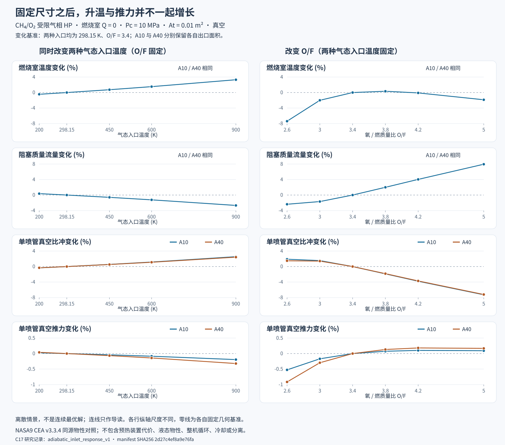

# 固定喷管下的气态入口焓与混合比响应

计算日期：2026-10-05。任务ANA-007；固定CEA v3.3.4在本机新运行12组工况。没有新检索，型号原文的核验日期不变。

在本次离散气相算例中，同时提高两种入口焓会提高燃烧温度和单喷管比冲，但固定室压、喉面积后，阻塞流量下降，推力略降。改变O/F时，温度、比冲和推力也不在同一个采样点达到最高。**这回答的是气相方法的响应，不是朱雀三号或长征十号乙的实装改进量。**



## 比较条件

所有工况采用九种中性C/H/O气体、NASA9 CEA v3.3.4形成焓基准、理想气体混合物。C17先查询纯CH₄/O₂入口焓，再由显式焓HP接口求零热交换燃烧室，冻结燃烧室组分后求喷管。

| 不变的条件 | 数值与含义 |
|---|---|
| 燃烧室压力 | 10 MPa，作为给定输入，不解供给系统/喷注器与室压的耦合 |
| 喉面积 | 0.01 m²；由阻塞通量决定流量，不指定54.3659 kg/s作为恒定值 |
| 两套独立喷管 | A10的出口0.1 m²、A40的出口0.4 m²；各套内部不改几何 |
| 背压 | 0 Pa；不研究海平面分离或实际回收过程 |
| 气相燃烧室边界 | Q=0、无入口动能/轴功；入口形成焓不重复加热值 |
| 基准工况 | CH₄/O₂入口温度均298.15 K，O/F=3.4 |

温度轴为两种入口同时取200/298.15/450/600/900 K；另有只加热CH₄或O₂至600 K的两点。O/F轴取2.6/3.0/3.4/3.8/4.2/5.0，入口温度均298.15 K。合并共有12组条件。这些离散值用于方法响应，不是液态物性的误差范围或真实发动机运行窗口。

“气态”是受限模型声明。尤其在10 MPa附近，程序没有验证真实流体近似、入口相态稳定或设备可达到该条件。200 K点在拟合护栏内，不据此证明真实推进剂状态正确；900 K也不是推荐预热方案。

## 实际C结果

下表全部为A10真空单喷管；A40与全部组分、出口状态在[研究清单](../results/research/adiabatic_inlet_response_v1/manifest.json)中。仅此处为阅读四舍五入，归档保留原double输出。

| 工况 | 燃烧温度 K | c* m/s | 流量 kg/s | 推力 kN | 比冲 s |
|---|---:|---:|---:|---:|---:|
| 基准298.15 K / O/F 3.4 | 3673.615 | 1839.387 | 54.365932 | 173.550363 | 325.520252 |
| 两入口200 K | 3657.164 | 1832.718 | 54.563760 | 173.591796 | 324.417467 |
| 两入口450 K | 3700.460 | 1850.371 | 54.043202 | 173.480491 | 327.332327 |
| 两入口600 K | 3729.628 | 1862.449 | 53.692759 | 173.401434 | 329.318622 |
| 两入口900 K | 3795.047 | 1890.076 | 52.907920 | 173.212417 | 333.839454 |
| 仅燃料600 K | 3699.439 | 1849.951 | 54.055475 | 173.483200 | 327.263117 |
| 仅氧化剂600 K | 3704.407 | 1851.997 | 53.995762 | 173.469983 | 327.600069 |
| O/F 2.6 | 3401.880 | 1884.109 | 53.075490 | 172.637483 | 331.680858 |
| O/F 3.0 | 3600.082 | 1870.817 | 53.452572 | 173.257084 | 330.523023 |
| O/F 3.8 | 3685.747 | 1803.324 | 55.453160 | 173.679506 | 319.375501 |
| O/F 4.2 | 3670.050 | 1767.905 | 56.564115 | 173.727795 | 313.189822 |
| O/F 5.0 | 3605.124 | 1703.878 | 58.689656 | 173.710593 | 301.817253 |

两入口从298.15 K升到900 K，混合入口焓增加0.911605 MJ/kg，燃温增加121.433 K。A10比冲增加2.5557%，流量降低2.6818%，推力降低0.1947%；A40比冲由350.314070 s升到358.809756 s，推力由186.769129 kN降到186.168245 kN。不能把升比冲直接说成升推力。

原因可以从保存状态复核：

```text
mdot = Pc × At / c*
Isp  = Veff / g0
F    = mdot × Veff = Pc × At × Cf
```

入口加热使c*提高，固定Pc/At下流量随之下降；推力取决于Cf，而非只取决于Veff。该结论只适用于本次条件和冻结方法，不是所有推进剂或喷管的通用单调定理。与此前[给定流量重新定尺寸的循环扫描](improvement-analysis.md)不同，本次没有随工况修改喉或出口面积。

组分也在变化：两入口从298.15 K升到900 K时，主室H₂O摩尔分数由0.473455降到0.439096，OH由0.075416升到0.090217，H由0.025013升到0.033288。这与受限气相高温解离变化相符；本次不定量分解每条反应对性能的贡献，也不处理凝聚相、电离或积碳。

只加热氧化剂至600 K的比冲增幅略大于只加热燃料至600 K。入口焓按质量加权，两物质cp也不同，因此不能把相同温升看成相同总输入能量；不能据这两个点选定真实预热系统。

O/F轴的六点中，A10/A40最大比冲都在2.6采样点；最大主室温度在3.8，最大推力在4.2。2.6位于采样边缘，**没有证明最佳O/F或约束最优设计**。富燃到较富氧时，H₂摩尔分数由约0.199546降到0.026726、O₂由约0.001014升到0.152136；不能用更高燃温或更完全氧化单独评价发动机性能。凝聚碳、燃烧稳定性、冷却和贮箱/泵限制均未评价。

## 新参考与校验

实际运行固定提交`4c5c612efa2002a94e3a5a1f33b1674d55c65340`的CEA v3.3.4，使用相同CH₄/O₂气态入口温度、Pc、O/F及物种集合。rocket卡不指定主室温度，用HP求温度；`frozen nfz=1`在无限面积燃烧室冻结，出口面积比10/40。纯HP的C结果也与该卡的燃烧室列对照，不把冻结出口拿去比平衡出口。

共36份成功HP/喷管报告，其中24份有固定几何。新参考最大差值：

| 字段 | 最大绝对差 | 验收绝对容差 |
|---|---:|---:|
| 主室温度 | 0.004568 K | 0.02 K |
| 主室焓 | 0.485642 J/kg | 3 J/kg |
| 主室熵 | 0.433229 J/(kg·K) | 0.5 J/(kg·K) |
| c* | 0.004662 m/s | 0.03 m/s |
| 真空有效速度 | 0.005701 m/s | 0.03 m/s |
| C的HP焓残差 | 0.007868 J/kg | 0.01 J/kg |

容差来自固定打印口径及现有求解契约，不是实验误差或可预测真实发动机的精度。CEA与C共用物性来源；这是不同实现的方法核验，不是独立物性测量。未打印物种依明确`trace=1e-8`列表核对，不当成精确零；CEA平衡cp/速度CF没有与不同口径的冻结cp/含压力推力CF硬比。

[版本v1](../results/research/adiabatic_inlet_response_v1/manifest.json)保存51次C运行（10次物性、12次HP、24次固定喷管、5次预期拒绝）及12次CEA运行。共155个文件，包含原卡/输出/日志、C的stdout/stderr、构建/测试清单、固定上游两份源码、输入及哈希；不带重复exe。归档如实记运行HEAD和`source_dirty=true`，不把后续提交倒写成当时干净运行。

离线验证重算保存的NASA9状态、元素库存、能量/熵/Mach/通量、HP残差及推力关系，不在Python求燃烧或喷管。档案加入测试身份后要重新构建验收；档案内原测试身份仍是归档前的实际测试。反例覆盖错误热量/流量/Mach/组分、几何/命令/条件错配、冻结参考篡改、失败stdout、布尔退出码/比较值、额外目录、构建/上游身份和时间错误；重算文件哈希仍不放行这些语义错误。

```powershell
python tools/adiabatic_study.py verify results/research/adiabatic_inlet_response_v1
python tools/adiabatic_study.py plot results/research/adiabatic_inlet_response_v1
python tools/quality.py
```

重算用`archive results/research/NEW-ID`；目标必须不存在。SVG由已验收C记录生成，有数值指纹和漂移测试；折线仅帮助阅读离散点，不是插值求解或连续最优曲线。

## 对大作业的作用与剩余工作

本次补充REQ-02的自动C计算、REQ-03的同条件比较，以及REQ-04/05的参数基准/实现可追溯性。得出的可用结论是：评价可能改进时必须同时看比冲、流量、推力、几何和供给条件，不能只看燃温或比冲。

预热能量在燃烧室入口之前提供；燃烧室Q=0不表示整机不需要预热功率。尚未研究加热器、换热器、压损、供给约束或净能效，不能称“免费提高性能”。本次也没有液态CH₄/O₂、煤油替代物、全循环固定硬件轴功/热闭合、实验/实装验证、冷却/分离/寿命结论。

下一步回到两型所需输入：核验液态甲烷/液氧和煤油候选的相态、温压、形成焓基准、密度与许可，明确哪些可进入C算例，哪些仍未知。不继续用甲烷气相图填充长征十号乙一级的煤油性能；PPT和最终报告仍后置。
