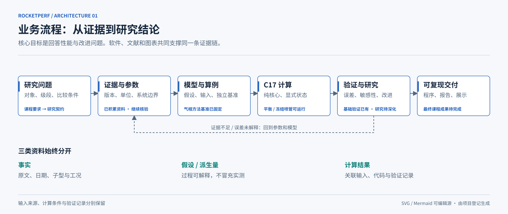
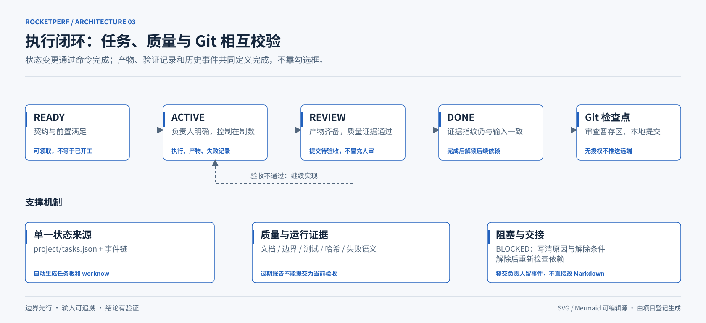

# 作业对接与工程架构

打开[离线架构浏览页](index.html)，先看作业对接总览，再切换业务、计算和执行三视图。图中文字可选取、链接可离线跳转；不依赖网络或CDN，可直接打印。

## 作业对接总览

三条老师研究要求对应“证据与参数 → C计算 → 条件性改进分析”，共同验证支撑源码、发布版、PPT、报告四项交付。它区分老师要求、项目实现选择、已有方法和未覆盖项，不画虚假的完成率。REQ编号对应[映射](../requirements-map.md)，入口焓及热边界见[审阅](../research-thermal-boundary.md)。[Mermaid源](assignment.mmd)保留简版逻辑，SVG是为阅读设计的详细布局。

## 业务流程

展示研究问题如何经过证据、模型、计算、验证形成交付，以及证据不足时回到哪里。它不是宣称所有研究阶段都已完成。

## 功能核心

实线表示主要编排/调用，虚线表示公共接口依赖。图中可见NASA9→九气相产物TP/HP（气态温度/焓或固定液态反应物锚点）、冻结喷管及外排循环的连接；灰色框为给定热状态的循环原型，不支持回流混合。[气态显式焓](../adiabatic-inlet-validation.md)与[固定液态锚点](../liquid-anchor-validation.md)仅闭合燃烧室和单喷管，不改变循环热状态、不提供连续液体EOS。为避免连线遮挡，少量公共依赖用脚注说明，完整依赖图见[Mermaid源](components.mmd)。

## 任务流程

展示任务状态、质量证据、阻塞/交接和Git检查点。REVIEW是提交验收准备，不表示已有独立人员审查。

## 维护图的方式

- 模块名、角色、状态、源码和允许依赖维护于`project/modules.json`。
- 作业布局/说明维护于`tools/assignment_diagram.py`，三视图维护于`tools/render_architecture.py`；业务图不机械画成文件树。
- 运行`python tools/render_architecture.py`生成SVG、Mermaid及HTML。修改图形后渲染检查文字、连线和边界，不能只凭生成成功。
- `python tools/project.py check`验证图与登记/生成源一致；生产依赖变化会要求同步布局，避免图看起来漂亮却失真。

作业总览与三视图均已在本机渲染并视觉核对。各图保留SVG原图和Mermaid文本，便于编辑和讨论中复用。详尽模型假设仍以[工程契约](../engineering.md)为准，任务规则见[治理说明](../governance.md)。
