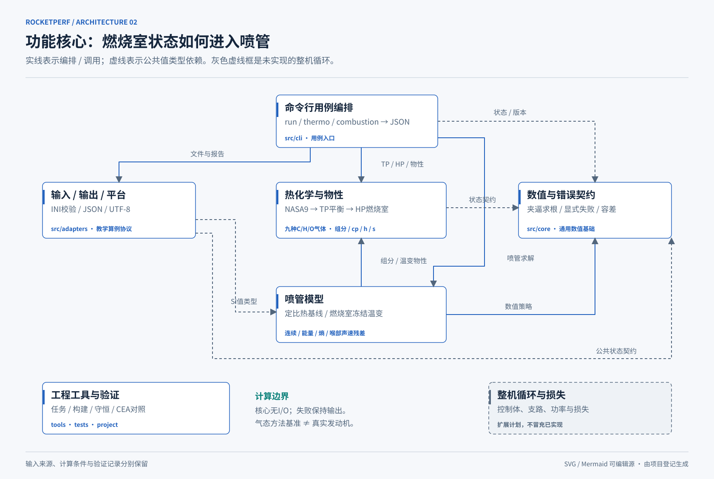

# C17工程基底与设计约定

程序版本：0.1.0。计算模型分别以ID标明：定比热教学基线、受限气相TP/HP、燃烧室冻结温变喷管和给定热状态的外排循环，仍不是两型真实发动机求解器。契约见[基准说明](benchmarks.md)、[算例格式](case-format.md)、[热化学验证](thermo-nozzle-validation.md)和[循环验证](cycle-validation.md)；可视化入口见[架构三视图](architecture/README.md)。

## 为什么采用这些设计

采用“纯计算核心＋外部适配器”的分层方式。核心不读文件、不打印、不分配堆内存、不读取环境和全局可变状态；相同输入和数值策略产生确定结果。CLI处理流程、文件、编码和输出格式。

模块登记由`project/modules.json`维护，GCC与CMake共用生产源码清单；工具自动核对源码归属、直接依赖和纯核心边界，图源漂移会阻止验收。

| 设计原则/模式 | 当前具体实现 | 解决的问题 |
|---|---|---|
| 依赖方向与端口/适配器 | 公共API在`include/rocketperf/`；文件/JSON/Windows编码在`src/adapters/` | 核心可被测试、CLI或以后其他界面独立调用 |
| 函数式核心 | `rp_nozzle_solve_ideal`和数值求解无I/O与隐式状态 | 重复计算、测试和后续并行使用更可控；调用方仍须避免共享可写输出 |
| 值类型/显式契约 | 输入输出结构体字段自带单位；`const`输入 | 不把MPa、Pa或s、m/s混用；不改变调用方参数 |
| 策略注入 | 求根用函数指针+只读context，容差/迭代预算独立 | 复用求解机制，不把物理公式写死在通用数值模块 |
| 显式结果与事务式输出 | `RpStatus`、可选`RpError`；成功前只写局部结果 | 失败时输出保持原样，调用方不误读半成品 |
| 闭合输入schema | 缺字段、未知字段、重复字段和未支持模型均拒绝 | 防止拼写错误静默改变计算；避免默认套用未知模型 |
| 可追溯运行 | 构建manifest、输入/二进制快照与运行SHA-256 | 解释结果对应哪次输入和实现，而非只保存截图 |

不同物理模型用明确的C接口、输入值类型和模型ID区分，不引入插件系统或工厂类。定比热API保持原有含义；新热化学/冻结接口不隐式改写旧算例行为。

## 模块边界

- `src/core/`：状态码、类型明确的有限值检查、带预算的二分求根。
- `src/nozzle/`：定常、定比热、理想气体、喉部声速、超声速出口分支；匹配/欠膨胀范围。
- `src/thermo/`：固定NASA9、九物种气相混合物、带主元4×4消元与阻尼Newton的TP平衡、外层HP二分；数值耦合局部封装在热化学模块。
- `src/nozzle/frozen.c`：燃烧室组分冻结的温变准一维喷管；调用热化学混合物，不复制物性公式。
- `src/cycle/`：恒密度泵、温变冻结涡轮、单轴外排支路与主/支喷管；热状态给定，非零回流显式拒绝，不做补燃混合化学闭合。
- `src/adapters/`：严格INI读取、JSON输出和Windows UTF-8路径转换。
- `src/cli/`：输入→求解→报告的单一工作流；成功stdout为JSON，错误写stderr且非零退出。
- `scripts/`：构建、测试、一次运行的归档和项目完整性核验。
- `tests/`：C模块检查、Python标准库黑盒测试及独立解析数值参考。

格式化错误文本使用`snprintf`，不代表核心执行文件/控制台I/O。运行时无Python/Fortran物理求解依赖；Python仅执行黑盒验证，PowerShell仅组织构建和运行。

## 数值和错误契约

- 用double，不开启fast-math。NaN、无穷、非法维度和越域工况失败，不输出伪造零值。
- 根必须有有限、有效的夹逼区间；不通过乘积判断符号，避免乘积溢出。
- 默认根容差为绝对/相对x各`1e-12`、函数残差`1e-12`、最多200次；物理模型另外检查相对面积残差≤`1e-8`。
- 求根达到x精度，不必然满足物理残差；二者分别检查。
- 输出检查防止派生量上溢、下溢为零或出现无效数。
- 初版明确拒绝过膨胀/高背压工况；这是一项保守的软件适用域限制，不意味着所有过膨胀流动在物理上都不可能。
- 错误类别包括参数错误、适用域错误、根未夹逼、不收敛、数值错误、文件错误和格式错误。

MinGW的类型泛化`isfinite`宏在严格转换警告下产生不必要的float窄化诊断。项目用double类型的`rp_isfinite`做有序范围比较，保留`-Wconversion -Werror`，未通过关闭警告掩盖问题。

## 构建和维护

本机Windows通过GCC14.2.0的Debug/Release；CMake/Ninja独立构建另留记录。历史Linux sanitizer仅覆盖当时基线，不覆盖本轮新模型；本轮不调用WSL。远端CI尚未执行。Python标准库统一工程行为，PowerShell保留兼容入口。

构建/测试/运行使用不可变产物与显式状态，完整规则见[治理规范](governance.md)。当前PASS关联源码、验证输入和具体二进制；过期结果不能用于本次验收。

新模块必须具备：模型/数据适用域、明确单位、失败语义、一个独立参考和合适的守恒/性质检查。循环还须区分所需热交换与绝热燃烧预测；不能通过倒算热量再宣称独立能量验证。只在有真实需要时增加抽象层。变量、输入、数值策略和算法版本发生实质变化时，补充测试与决策记录。

任何移植先查`third_party/README.md`的来源与许可要求。本项目未擅自选择整项目对外许可证。
