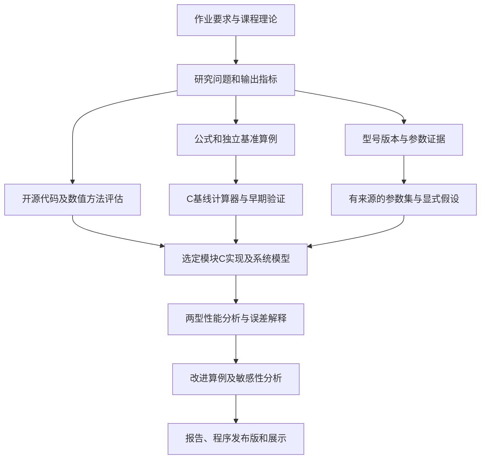

# 大作业完整思路与项目规划

规划日期：2026-10-01；课程展示：2026-10-16，周五第3—5节。

这是10月1日的总体规划，日期/角色是建议，不是老师新增要求。当前已到受限气相方法与外排原型的计算研究，见[改进分析](improvement-analysis.md)。工作面以[worknow](../worknow.md)为准；PPT/最终报告后置，不按下面旧日程提前启动。早期任务顺序仅作历史背景。

## 1. 项目究竟做什么

围绕朱雀三号和长征十号乙，先调查动力系统，再用C程序计算和解释性能，最后研究一项有依据的改进方案。研究结论、计算程序和报告应围绕同一组问题，不能各自独立。

建议题目：**《朱雀三号与长征十号乙动力系统的性能计算、系统对比与改进分析》**。

项目要回答三类问题：

1. **现有系统怎么样？** 两型火箭各级采用什么方案，哪些参数有可靠来源，性能差异在什么条件下可比较？
2. **为什么会这样？** 推进剂热力性质、喷管膨胀、实际损失和整机循环边界分别影响什么？
3. **怎样改进才有意义？** 改善某项性能要付出什么代价，结论对哪些未知参数敏感，是否适合重复使用任务？

最终交付：C源代码、可运行程序、研究报告、10分钟以内展示PPT。原始要求对应关系见[requirements-map](requirements-map.md)。

## 2. 研究对象和比较方式

按两型火箭的一级/二级建立四个对象。各对象内部必须带日期、飞行批次或产品版本，不只写一个发动机名字。

| 对象 | 研究重点 | 当前证据带来的限制 |
|---|---|---|
| 朱雀三号一级动力 | 多机并联、海平面/高度性能、回收工作要求 | 遥一A系列与当前产品页B系列分开，不能替遥二推定后缀 |
| 朱雀三号二级动力 | 真空性能、多次起动、喷管适应任务 | 早期TQ-15A文章的参数未必是目标飞行批次标定值 |
| 长征十号乙一级动力 | 液氧煤油、循环边界、多机及回收要求 | 当前可确认的系列/量级不等于全部子型号和内部参数 |
| 长征十号乙二级动力 | 液氧甲烷二级的性能与工作方案 | 精确型号、数量、循环和标定点仍需补证 |

比较分两层：

- **真实构型比较**：忠实呈现两型的实际不同条件，说明性能差异，不能把原因全归到某一个因素。
- **同条件对照实验**：在明示的共同条件下改变某一模型因素，研究因果趋势；这些是假设研究算例，不冒充真实型号工作点。

一级重点与一级比，二级重点与二级比。海平面与真空、推力室与整机、设计目标与实测值分栏。不能通过简单比冲排名认定整枚火箭优劣。

## 3. 从资料到研究结论的完整路径



资料调查、公式抽取、移植评估和环境准备可由组员并行推进。**通用C基线不必等到真实发动机所有参数齐全**：可以先用明确标记的标准/教学算例验证算法，再接入经核查的型号数据。这是组织上的并列工作，不代表启动多个agent的额外授权。

## 4. 第一阶段：调研要交出什么

调研至少形成四项产物，而不是一篇只有介绍性的综述：

1. **构型与循环证据表**：对象、日期、版本、发动机配置、推进剂、循环证据及能力验证阶段。
2. **参数字典与缺口表**：每个参数的原单位、工况、主室/整机边界、引用位置、事实/派生/假设/未知类别，以及哪个模块需要它。
3. **理论与基准表**：所用公式的假设和教材/论文页码，至少准备可独立验证喷管和系统守恒的算例。
4. **开源移植评估**：读取实际核心代码、调用链、依赖、数据文件和验证案例，决定移植哪些功能。

参数不足时，先判断它是否是当前计算的必要输入，再选择补查、由充分约束的已知量推导、做有依据的范围研究，或将该项结论标为无法确定。不允许静默用同系列另一型号补齐。

文献优先级：课程内容与CEA理论/算例 → 目标型号制造商/研制者资料 → 循环与节流/复用研究 → 具体模块源代码。检索遵守Grok入口约束，新结果保留实际日期。

## 5. 程序准备算什么

### 5.1 基线：课堂理论能直接验证的性能

模型为定常准一维喷管，先用明确的气体性质假设建立可核验基线。典型输入是室压、入口热状态、气体性质、喷管面积比和环境压力；输出出口状态、喷气速度、特征速度、推力系数、比冲等。

只有喉部面积/流量尺度得到定义，才能由模型独立给出绝对质量流量和推力。若尺度缺失，可以先比较无量纲系数和比冲，不能为得到某个推力数字任意填面积。若由公开推力反算几何，该数据属于校准输入，不能再作为独立验证点。

代表关系：

- `F = mdot × ve + (pe − pa) × Ae`。
- `c_star = pc × At / mdot_chamber`。
- `CF = F_chamber / (pc × At)`。
- `Isp_s = F / (mdot × g0)`，`c_eff = g0 × Isp_s`。

相同边界下的参数恒等关系用于检查自洽，不单独证明物理真实性。

### 5.2 热化学与物性：提高模型解释能力

计划比较：定比热/固定性质、温变热容、受限范围化学平衡与冻结膨胀。每提升一级都要增加数据来源、数值验证和适用范围说明。

重点不是把所有CEA功能重写一遍，而是选出本研究所需的热物性/平衡/喷管功能，形成可以解释和维护的C实现。煤油替代物、热化学焓基准、反应物初始状态和数据库版本必须记录。

**如果温度、组分和比热比仍固定，就不能声称研究出了混合比最优值。** O/F影响性能的研究必须由相应热化学模型或有来源的数据支撑；外部软件结果用于校核时不能偷偷成为声称“全C求解”的核心。

### 5.3 整机层：把发动机与推力室区别算出来

建立主推力室与整机的控制体、支路流量和排气贡献。根据选定循环，逐步加入泵/涡轮的简化功率平衡及明确的压降/效率假设。

至少回答：总消耗如何计量？冷却后返回的流量是否重复记账？涡轮排气在哪里计入推力？未知支路参数如何影响整机比冲？

可以分两档：先验证守恒与边界；在循环与部件证据足够时求解耦合系统。没有泵图谱和瞬态状态数据时，不把简化平衡模型称作真实发动机全工况复现。

### 5.4 变工况与复用相关分析

优先算环境压力变化、可支撑的稳态参数变化、性能损失情景和总冲/消耗的积分示例。真实时间历程不足时用标为“研究情景”的输入，不推断真实回收轨迹。

节流不是把推力和流量一律等比例缩放。冷却、喷注稳定性、泵工作范围、流动分离、起动可靠性需要各自证据。模型覆盖不到的约束在图表中标明，不能拿稳态曲线证明多次起动或寿命。

## 6. C实现与开源借鉴路线

TECH-001已进一步冻结本节的工具职责和算法路线，执行以[技术选型](technology-stack.md)为准；下面的项目能力说明作为背景，不能再将所有候选同时当成待选主框架。

| 项目/资料 | 本项目优先学习什么 | 不应自动承担的范围 |
|---|---|---|
| NASA CEA与RP-1311 | 热化学方程、数据处理、火箭性能与算例 | 完整复刻多相、电离、激波等全部功能 |
| RocketCycles | 循环连接、部件关系、质量/功率残差与求解 | 把Python外层翻成C后仍隐藏依赖原求解器 |
| Pyskyfire | 推力室/冷却/循环组织和验证案例 | 整套可视化与报告功能，以及所有复杂传热能力 |
| Cantera/CoolProp | 物性定义、替代模型和独立对照 | 在此次课程周期内整库重写 |

工程建议为C17、控制台入口、核心与输入输出分离。功能相同不要求逐行翻译；移植原代码与按论文独立实现应分别记录，版权和许可也按实际使用方式处理。

拟定完整模块（core/nozzle/CLI/适配器已由ENG-001实现首版，其余以实际任务为准）：

```text
src/
  cli/          参数读取、交互和结果导出
  core/         单位、数值求根/迭代、错误与残差
  thermo/       物性及选定热化学能力
  nozzle/       准一维膨胀与推力室性能
  cycle/        主室/整机边界、部件和系统平衡
  study/        批量工况、敏感性、结果组织
include/        稳定的模块接口
cases/          基准/型号/假设研究算例，类别分开
tests/          独立参考与错误路径验证
data/           带来源与版本的参数/必要物性数据
results/        运行输出与输入版本记录
deliverables/   最终提交材料
```

先让“一个输入 → 一个可信结果 → 一个独立检查”跑通，再扩大工况和模块。图表可由辅助脚本绘制，但报告中的物理计算来源必须清楚；画图语言不改变核心计算语言要求。

## 7. 研究算例设计

| 算例组 | 研究目的 | 应输出什么 | 验收重点 |
|---|---|---|---|
| C0 标准基准 | 证明实现符合明确假设 | 输入、参考来源、C输出、误差与残差 | 独立预期值；不依赖目标型号缺失参数 |
| C1 四类对象基线 | 对应两型火箭实际问题 | 可算的性能参数、来源和未知字段 | 版本不混用；不能算的绝对量不强填 |
| C2 环境压力/喷管条件 | 解释海平面与真空、高度适应性 | `CF/Isp/F`中的可计算项随条件变化曲线 | 固定其他条件；模型越界区域明确 |
| C3 主室—整机差异 | 解释循环支路和损失 | 主室/整机参数对照、质量/功率残差、敏感性 | 控制体和流量不重复计量 |
| C4 模型保真度 | 判断简化假设带来的差别 | 相同输入下不同模型结果与差异来源 | 不把模型差异误当代码错误或硬件损失 |
| C5 改进研究 | 回答改哪里、何时有益 | 基线/改进/代价/不确定性对照 | 同一比较基准，结论不超出约束 |

每组至少形成一个解释清楚的代表案例；更多扫描点应服务于问题，不以图多为目标。C4若高保真模型未通过验证，保留独立参考分析，不把未验证模块用于最终结论。

## 8. 改进研究的选题与选择节点

优先候选为：**整机支路流量与排气利用对性能的影响**。它与课程“推力室和发动机的区别”直接相关，能形成系统边界、计算与优缺点讨论。

可并行论证的第二候选是：**喷管膨胀适应性与不同环境压力下性能的权衡**。若缺少整机支路证据，这一方向更容易建立清晰、可核验的课堂模型，但不能忽略分离/侧载等一维模型未覆盖约束。

选择标准：对作业相关；输入可追溯或假设可解释；有独立参考；能计算收益和至少一种代价/限制；能检验对关键未知量的敏感性。建议10月5日冻结主选题，避免做到最后才确定“改进什么”。

不预先承诺“提高X%”。结论可能是收益很小、依赖某项假设、或有性能收益但不值得复杂度代价，这些仍是有价值的研究结果。

## 9. 验证、结果可信度与范围控制

每个模块按以下顺序推进：定义/单位检查 → 解析或公开算例 → 守恒和失败路径 → 独立工具/数据对照 → 在适用域内开展研究。最终验证矩阵沿用[verification](verification.md)。

分开记录三种误差来源：数值实现误差、模型假设差异、输入/数据库不确定性。校准案例和验证案例分开；缺乏概率依据时报告情景包络而非置信区间。

| 风险 | 处理 | 不能做的替代 |
|---|---|---|
| 真实型号参数缺失 | 继续针对性核查；无法关闭则保留未知、用明确标注的情景或无量纲比较 | 把其他批次数据拼成真实参数 |
| 热化学移植无法按期验证 | 在10月5日前评估收敛与数据可行性；暂以明确热状态输入的C基线及系统分析交付，移植作为独立研究记录 | 在未验证模块上做O/F最优或真实燃温结论 |
| 循环部件信息不足 | 先做守恒边界和条件性敏感性；候选主选题切换需记录理由 | 编造泵图谱、节流稳定范围或实际寿命 |
| 参考项目安装耗时 | 限定需运行的最小算例，固定依赖；同时保持自有基线推进 | 等整个大型项目装完才开始任何计算 |
| 时间不足 | 优先减少界面、附加模型和图表数量，保留两型研究、C计算、改进计算、验证与四项交付 | 只交新闻综述或只有界面的程序 |

本计划是分层交付，不代表预先放弃深入研究；数据和验证支持的模块应继续推进，不能用“时间可能不够”替代实际可行性评估。

## 10. 排期记录与当前使用方式

以下是9月29日规划中的建议排期，日期为历史计划记录。实际进度、负责人和任务状态以`project/tasks.json`与生成的worknow为准，不把过期计划日期写成当前承诺。不要让“读完所有文献”成为开始编程的前置条件。

| 日期 | 主要工作 | 到点应能看到的产物 |
|---|---|---|
| 10/1—10/3 | 型号/参数深化、核心代码评估、课程基准、环境验证；通用基线并行 | 四类对象证据表、首批基准、C17构建命令；最小C计算器完成首次基准运行 |
| 10/4—10/6 | 热化学/喷管能力、参数集、主室—整机边界；10/5选定主改进题 | 可批量运行的基线、模块范围与依赖说明、第一版两型结果；数据不足项显式列出 |
| 10/7—10/9 | 选定循环模块、环境工况、敏感性和独立对照 | 守恒检查、误差分解、能够解释的对比曲线 |
| 10/10—10/12 | 完成改进算例，检验结论稳健性；10/12冻结主要模型 | 基线/改进/代价对照，报告核心结论及适用范围 |
| 10/13—10/14 | 报告、流程图、程序说明、PPT和发布包装 | 四项成果初稿；全组可复现同一组代表案例 |
| 10/15 | 全流程验收、演示排练、修正问题 | 定稿、发布版复测、≤10分钟展示、5分钟问答准备 |
| 10/16 | 课堂汇报与组长提交 | 源码、发布版、PPT、报告完整提交 |

任务ID对应：调研RES-001/002/003/004/005；环境OPS-001；参数DATA-001；早期基线IMP-000；正式范围DES-001；整合实现IMP-001；验证VAL-001；研究ANA-001；报告DOC-001；发布REL-001。实时状态只在[任务板](tasks.md)维护。

## 11. 小组分工建议

按6个职责规划，不假设实际已确定6名组员。5人时可合并部分职责，7人时可增设独立验证角色。

| 角色 | 主要职责 | 必须交付的实物 |
|---|---|---|
| 总体/组长 | 范围、任务接口、比较逻辑、进度与整合 | 构型边界、决策记录、整合算例、提交检查 |
| 数据与文献 | 型号版本、参数来源、文献引用和冲突 | 可追溯参数集、证据表、引用清单 |
| 热力与喷管 | 公式、热物性和喷管C模块 | 模块源码、假设说明、基准验证 |
| 循环与系统 | 控制体、流量/功率、整机损失 | 系统模块、守恒检查、C3类算例 |
| 验证与研究 | 独立参考、敏感性和改进试验 | 验证矩阵、误差分析、改进结论 |
| 集成与报告展示 | 构建/发布、结果图表、报告/PPT组织 | 可运行包、复现说明、报告与展示 |

每名组员都应能解释自己引用的参数、使用的假设和产出的计算，不把“让工具生成文件”当作分工贡献。报告/展示负责人从第一天整理材料，不等最后才接收一堆截图。

## 12. 最终报告和展示怎样讲

报告建议结构：研究目标与背景；两型系统与资料证据；模型与计算方法；C程序设计/流程；验证；基线性能与比较；改进算例和不确定性；结论与限制；参考文献；组员分工。

10分钟展示可按：问题与方案1分钟；两型对象与参数依据1.5分钟；模型/程序1.5分钟；验证1分钟；结果比较2分钟；改进与代价2分钟；结论1分钟。程序演示使用已经复现的短案例，不现场启动大范围优化或安装依赖。

建议关键图表：构型与循环边界、参数来源/缺口、独立验证对照、环境特性、主室与整机差异、改进收益与敏感性。数据不足时如实画出适用域，不用虚构曲线填版面。

## 13. 项目完成标准

- 两型火箭都被实质研究，引用能对应正确版本、级段和工况。
- C程序完成真实的核心求解，结果可由给定输入重复产生。
- 计算假设、单位、系统边界与数据来源可解释。
- 有独立验证，不只靠与公开额定值拟合。
- 优缺点与至少一项改进讨论含计算，说明代价与不确定性。
- 四项最终成果齐全，程序与报告使用同一参数版本。
- 全组能在规定时间内讲清楚“查到了什么、怎么算、为什么可信、改进是否值得”。

## 14. 10月1日的第一批动作（历史规划，不是当前领取入口）

1. 推进RES-001，建立四类对象的版本—参数—缺口矩阵。
2. 推进RES-003，锁定第一组喷管基准与变量单位字典；同时进行OPS-001的真实编译运行检查。
3. 推进RES-002，选两个优先项目读取核心源码，形成实际依赖和C移植范围评估。
4. 基准与工具链具备后立即启动IMP-000，不等待目标型号所有数据齐全；所有教学/标准输入显式标记。
5. 用第一批证据和基线结果，在10月5日前冻结主改进题与首版模块范围。

本次交付为完整规划与项目文档同步，没有将上述未执行任务提前标为完成。
