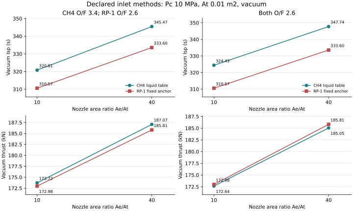

# 甲烷与固定RP-1同条件喷管研究

计算日期：2026-10-07。两种C方法在共同室压、喉面积、喷管面积比和背压下比较，所有燃烧、膨胀和方法间差值由C生成。[成对C接口](../include/rocketperf/propellant_study.h)与[归档](../results/research/propellant_comparison_v1/manifest.json)保存输入、结果、参考和失败。

## 问题与结论

共同O/F=2.6时，甲烷方法A10真空比冲324.4251 s，比固定RP-1高13.8534 s，但推力172.6411 kN，比RP-1低343.5653 N。同At/Pc下，甲烷方法c*提高、质量通量降低，比冲与绝对推力不能用同一排名代替。提高面积比则提高真空有效速度，同时扩大出口几何并增大背压扣减。

三组混合比是明确情景，不是最优混合比：代表输入CH4=3.4/RP-1=2.6、共同2.6、共同3.4。不同燃料同O/F不等于同当量比，入口状态也各有方法基准。结果不对朱雀三号/长十乙、复用成本或实际推进剂优劣作排名。

## 输入与计算边界

共同条件：Pc=10 MPa、At=0.01 m²、面积比10/40、背压0/5/100 kPa。CH4入口查表状态为120 K/10 MPa，O2为100 K/10 MPa；固定RP-1为298.15 K、O2(L)90.170 K。两边相同九种中性理想气体HP和燃烧室冻结喷管，Q=0。

CH4连续表保留HEOS残余焓，并按CEA理想化学焓基准对齐；RP-1是CEA的固定指定焓/元素记录，不含密度或压力修正。燃料元素H/C分别4与1.95。不能把差异全部归给某一种实际燃料的化学优势，也不能用RP-1代表国产煤油批次。

## 真空结果



| O/F CH4 / RP-1 | 面积比 | CH4 Isp/s | RP-1 Isp/s | CH4 F/kN | RP-1 F/kN | C差值 Isp/s | C差值 F/N |
|---|---:|---:|---:|---:|---:|---:|---:|
| 3.4 / 2.6 | 10 | 320.8119 | 310.5717 | 173.7212 | 172.9847 | 10.2402 | 736.5029 |
| 3.4 / 2.6 | 40 | 345.4680 | 333.5965 | 187.0726 | 185.8092 | 11.8716 | 1263.3909 |
| 2.6 / 2.6 | 10 | 324.4251 | 310.5717 | 172.6411 | 172.9847 | 13.8534 | −343.5653 |
| 2.6 / 2.6 | 40 | 347.7401 | 333.5965 | 185.0481 | 185.8092 | 14.1437 | −761.0818 |
| 3.4 / 3.4 | 10 | 320.8119 | 298.9103 | 173.7212 | 173.4432 | 21.9016 | 277.9963 |
| 3.4 / 3.4 | 40 | 345.4680 | 321.6881 | 187.0726 | 186.6601 | 23.7799 | 412.5127 |

差值统一CH4−RP-1，直接保存于C JSON。代表A10中CH4燃温3602.7558 K低于RP-1的3724.0068 K，而c*1810.9996 m/s高于1760.6575 m/s；燃温高低不能单独代替综合性能指标。

共同2.6的甲烷流量54.26367 kg/s，RP-1为56.79696 kg/s。它解释较高比冲同时较低推力：固定Pc/At下`mdot=Pc*At/c*`，评价必须同时看流量、有效速度和压力推力。

## 面积和背压代价

面积比10→40时，出口面积0.1→0.4 m²。代表甲烷真空比冲320.8119→345.4680 s，RP-1为310.5717→333.5965 s；固定At下同一入口的流量保持不变，差异来自冻结膨胀。该几何变化不包含喷管质量、冷却、长度或侧载。

5 kPa背压分别扣除500 N(A10)、2000 N(A40)，来自`pa*Ae`。100 kPa时，A10两方法仍在当前支持域内；A40各组全部拒绝，因为背压高于理想出口压力。越域不是零推力，也不是分离/侧载计算。

## 验证与复现

18个成对点中15成功、3越域，每点另运行两路单独CLI，共57次C（含三个错误输入/语法例）。8张新CEA卡覆盖CH4/RP-1各O/F2.6/3.4的HP/冻结参考，打印感知核验1410项。成对结果与单独接口的物性、残差、喷管和几何逐字段一致；C差值与保存状态复算一致。

同源热化学数据的软件对照不是实验。温度/组分/声速/能量/熵/连续方程、库存质量、固定几何关系和拒绝协议分别核对，不只检查JSON可解析或数字为正。入口和产物简化的限制沿用各自方法专题。

```powershell
./build/release/rocketperf.exe study propellants 3.4 2.6 10 0
./build/release/rocketperf.exe study propellants 2.6 2.6 10 0
./build/release/rocketperf.exe study propellants 3.4 2.6 40 100000
python tools/propellant_comparison.py verify results/research/propellant_comparison_v1
```

第三条预期退出4。成对API的任一输入/求解失败都保持调用方整份输出，CLI不输出半套结果。共同几何接口解决比较口径，原燃烧/喷管接口仍保留独立用法。

上述结果支撑课堂中燃烧物性、特征速度、压力推力、喷管面积比及性能收益/代价的分析。实际型号应用应补同批次Pc、主室O/F、喷管尺度、入口状态和支路口径；计算域内的软件方法结论与硬件判断分别使用。
