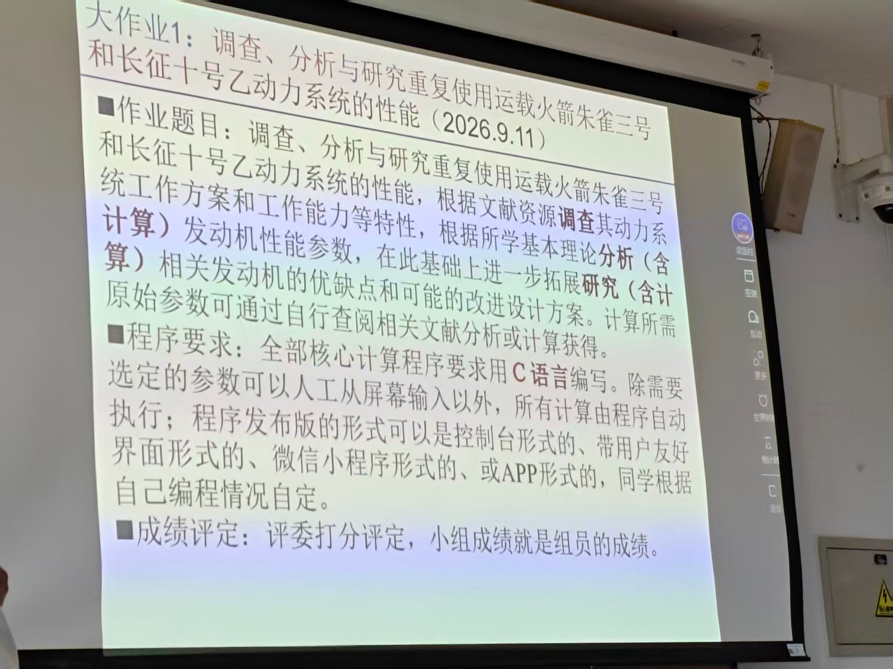
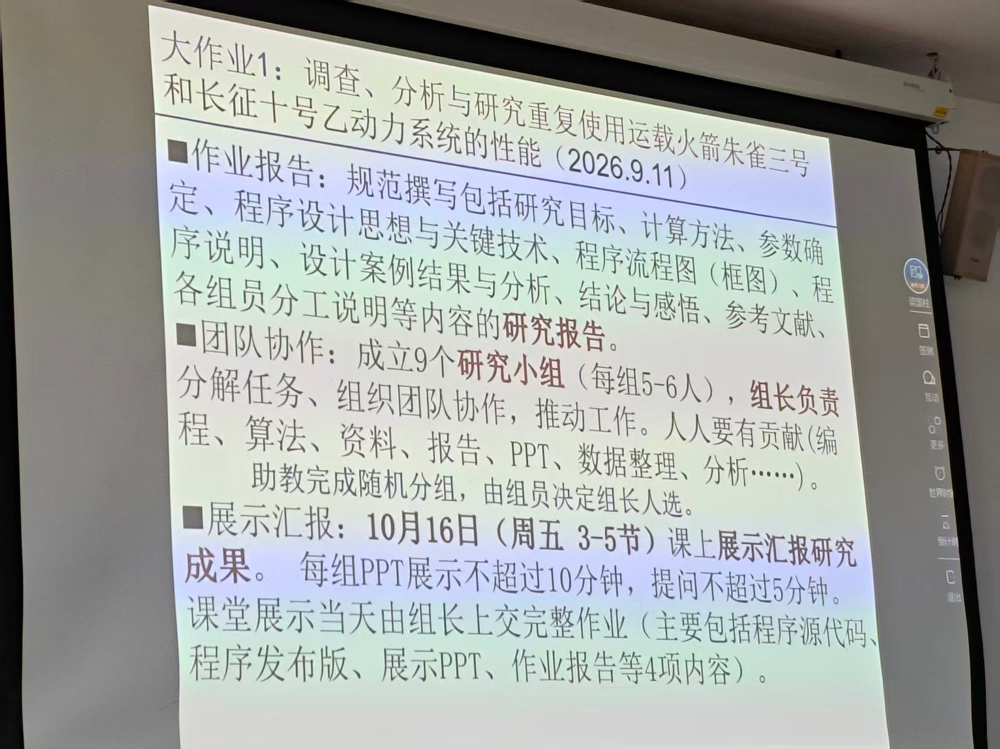

# 大作业1：作业要求存档

资料来源：用户提供的两张课堂投影照片。课件标注日期：2026年9月11日。存档日期：2026年9月29日。

本文按照片内容转录并整理排版；原图保存在同目录，便于核对。本文记录课程作业要求，不将此前讨论的技术路线、工具推荐或助手建议混入老师要求。

## 一、题目与研究任务

**调查、分析与研究重复使用运载火箭朱雀三号和长征十号乙动力系统的性能。**

根据文献资源调查其动力系统工作方案和工作能力等特性，根据所学基本理论分析（含计算）发动机性能参数，在此基础上进一步拓展研究（含计算）相关发动机的优缺点和可能的改进设计方案。计算所需原始参数可通过自行查阅相关文献分析或计算获得。

## 二、程序要求

- 全部核心计算程序要求用 **C语言** 编写。
- 除需要选定的参数可以人工从屏幕输入以外，所有计算由程序自动执行。
- 程序发布版的形式可以是控制台形式、带用户友好界面形式、微信小程序形式或APP形式，同学根据自己编程情况自定。

## 三、成绩评定

评委打分评定，小组成绩就是组员的成绩。

## 四、作业报告

规范撰写研究报告，内容包括：

1. 研究目标。
2. 计算方法。
3. 参数确定。
4. 程序设计思想与关键技术。
5. 程序流程图（框图）。
6. 程序说明。
7. 设计算例结果与分析。
8. 结论与感悟。
9. 参考文献。
10. 各组员分工说明等。

## 五、团队协作

- 成立9个研究小组，每组5—6人。
- 组长负责分解任务、组织团队协作、推动工作。
- 人人要有贡献，贡献内容可包括编程、算法、资料、报告、PPT、数据整理、分析等。
- 助教完成随机分组，由组员决定组长人选。

## 六、展示汇报与提交

- 展示时间：**10月16日，周五，第3—5节课**。结合课件标注年份，整理为 **2026年10月16日**；照片正文只写月日、星期和节次。
- 课堂上展示汇报研究成果。
- 每组PPT展示不超过 **10分钟**，提问不超过 **5分钟**。
- 课堂展示当天，由组长上交完整作业，主要包括以下4项：
  1. 程序源代码。
  2. 程序发布版。
  3. 展示PPT。
  4. 作业报告。

## 七、后续工作核对清单

以下清单由上述要求整理，未添加新的课程要求。

- [ ] 调查朱雀三号和长征十号乙动力系统的工作方案、工作能力等特性。
- [ ] 根据基本理论完成发动机性能参数分析与计算。
- [ ] 研究相关发动机的优缺点和可能改进方案，并包含计算。
- [ ] 交代原始参数的文献来源、分析或计算过程。
- [ ] 全部核心计算使用C语言实现，除参数输入外自动执行计算。
- [ ] 完成程序发布版。
- [ ] 报告覆盖第四节列出的内容，附程序流程图和组员分工。
- [ ] 准备不超过10分钟的PPT展示及不超过5分钟的提问环节。
- [ ] 展示当天由组长提交源代码、发布版、PPT和报告。

## 八、原始照片

### 第1页：题目、程序要求、成绩评定

### 第2页：报告、团队协作、展示提交要求

## 九、要求边界

- 两页照片未指定必须使用有限元、CFD、NASA CEA或其他特定计算软件。
- 两页照片未指定报告页数、源代码规模或具体发动机参数数值。
- 后续技术路线和工具选择属于实施方案，应与本文记录的课程要求区分；如老师补充要求，再更新本档案并注明来源与日期。

## 十、2026-09-29补充：本地课件存在版本差异

本地《第2章推力室和发动机的主要参数20260911.pptx》第2—3页包含同题作业要求。第3页写的是“8个研究小组（每组6—7人）”，与用户照片中的“9个研究小组（每组5—6人）”不同。目前无法仅凭文件名判断哪一版为最终安排，本档案保留照片原文，实际分组以老师/助教最终通知为准。

本地课件第2页还强调“所学基本理论能用尽用、能算尽算、学以致用”，第3页强调“完成作业的过程就是科学研究”。这是本地课件的补充文字，未出现在所存照片的相同位置。
